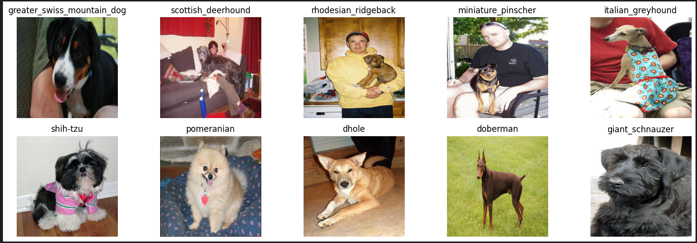
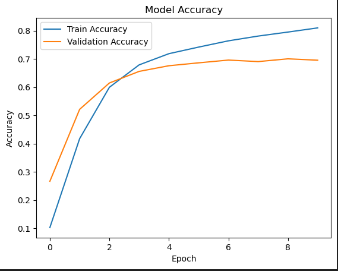
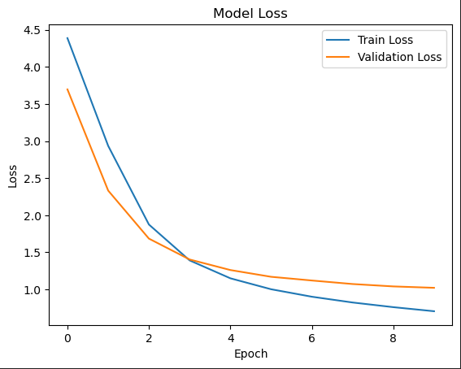
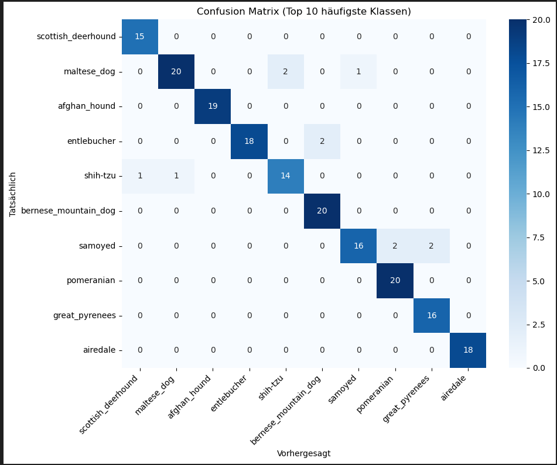

1 Introduction
ERkennung von Hunderassenerkennung hat praxisorientierte Anwendungsfälle. Ein Anwendungsfall ist z.B. in Tierheimen oder als App für Hundebesitzer. Außerdem dient es als erster Schritt, sich mit dem Erstellen von ML-Modellen zu beschäftigen.
Research Question: Wie kann ein Deep-Learning-Modell trainiert werden, um auf Grundlage von Hundebildern zuverlässig die jeweilige Hunderasse zu identifizieren?

2 Related Work 
Wir haben uns an dem Datensatz von Kaggle orientiert. Hier wurde bereits eine Competition veranstaltet, in der es darum ging, das best mögliche Modell für die Hunderasse Erkennung zu erstellen.
Außerdem gibt es viele andere Beispiele von anderen Bilderkennungsmodellen, welche wir auch auf unseren Fall anpassen können.
MobileNetV2 von Keras: http://keras.io/api/applications/mobilenet/
Kaggle Beispiel: https://www.kaggle.com/code/khanrahim/dog-breed/notebook

3 Methodology https://www.scrapy.org/

3.1 General Methodology 
1. Auswahl und Download eines Datensatzes. Wir haben uns für den Datensatz von Kaggle entschieden
2. Datenbereinigung und -aufbereitung. 
3. Training des Modells mit sklearn und tenserflow.
4. Evaluation unseres Modells. Erstellung eines Confusion Matrix um zu erkennen, wie gut die Rassen erkannt werden.(Hier haben wir bis jetzt noch nicht so viel gemacht)
5. Entwicklung einer Anwendung zur Klassifikation in Streamlit

3.2 Data Understanding and Preparation
Generell ist der Datenschatz schon gut gepflegt.
Es gibt 2 Datensätze mit jeweils ca 10.000 Bildern. Einer ist für das Training und einer für den Test des Modells. Der Tainingsdatensatz hat auch noch eine csv-Datei, welche zu jedem Bild die Rasse angibt. Zu den Terst bildern gibt es keine angegebenen Rassen. Der Testdatensatz beinhaltet nur die Bilder, ohne eine angegebene Rasse.
Wir haben hier vor allem die Trainingsbilder genormt und dabei alle Bilder auf 224x224 Pixel formatiert und die verarbeiteten Bidler neu abgespeichert.
Als Besipiel haben wir die genormten Bilder ausgegeben und dazu die Rassen angegeben.

3.3 Modeling and Evaluation 
Für das Training wurde MobileNetV2 verwendet. 
Gründe für dieses Modell:
- geringe Modellgröße/Speicherverbrauch: Unser Ziel ist es, die App für Mobile Apps auf Smartphones oder ähnlichem zu verwenden. Daher ist es wichtig, dass wir ein kompaktes Modell benutzen
- schnelle Vorhersagen: Bei einer App auf dem Smartphone ist es wichtig, dass wir schnelle Ergebnisse bekommen. Mit unserer App geht das fast sofort
- Modell ist gut anpassbar auf neue Datensätze, wie in unserem Fall die Hundeerkennung
- leichte implementierung des Modells

Parameter:
- BATCH_SIZE = 32
- LEARNING_RATE = 0.001
- DROPOUT_RATE = 0.7

Evaluation:
- accuracy: 0.8575

- loss: 0.5690

-Confusion Matrix

4 Results Describe
Artefakte:
- Ein trainiertes Modell zur Hunderassenaerkennung
- Eine Anwendung, die neue Bilder klassifiziert
Bibiliothek:
- Python
- TensorFlow
- numpy
- matplotlib
- seaborn
- sklearn

Konzept der App:
- User läd Bild hoch und kriegt eine Einschätzung welche Hunderasse das Bild zeigt
- Außerdem Aufteilung der 5 wahrscheinlichsten Hunderassen, die das Bild zeigen könnte

5 Discussion

Limitationen/weiter Verbesserungsmöglichkeiten:
- Unser Modell hat aktuell noch schwierigekeiten Rassen zu klassifizieren, wenn mehere Hunde unterschiedlicher Rasse auf dem Bild sind. Hier könnte man noch Modelle wie Yolov5 verwenden, welche dann einzelne Objekte(bei uns Hunde) erkennen und einzeln bewerten.
- Das Modell hat eine begrenzte Anzahl an Rassen, welche im Datensatz vorgegeben waren. Daher kann es keine Hunde von anderen Rassen erkennen und gibt ähnliche Rassen, welche bereits im Datensatz sind, aus. Das kann man beheben, indem man neue Bilder und Hunderassen in den input Datensatz einfügt und das Modell erneut darauf trainiert.

Für unseren Datensatz funtkioniert das Modell aber recht gut und wenn man die Rasen einfügt, welche auch in unserem Datensatz gepflegt sind, kriegt man meistens das richtige Ergebnis. Das funktioniert auch bei selbst aufgenommenen Bildern von Hunden.
Wie bereits erwähnt, ist das Modell noch nicht perfekt aber war für uns ein guter Einstieg, ins Machine Learning.
